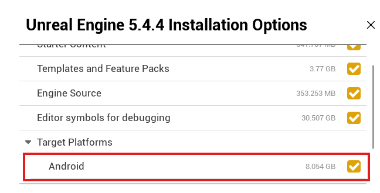

# VR Settings

### UE 5.4 Android

<figure><figcaption></figcaption></figure>

### UE 5.4 공식 요구 스펙

<table><thead><tr><th width="144">항목</th><th>버전</th></tr></thead><tbody><tr><td><strong>Android Studio</strong></td><td>Flamingo 2022.2.1 Patch 2 (2023.05.24)</td></tr><tr><td><strong>Java (JDK)</strong></td><td>OpenJDK 17.0.6 (2023-01-17)</td></tr><tr><td><strong>Android SDK</strong></td><td>SDK 33 (권장) / 최소 SDK 30</td></tr><tr><td><strong>NDK</strong></td><td>r25b</td></tr><tr><td><strong>Build-tools</strong></td><td>33.0.1</td></tr></tbody></table>



### Android Studio SDK settings

**SDK Platforms 탭:**

* Android 12L (API 32) 체크
* Android API 35 등 최신 버전은 체크 해제

<figure><figcaption></figcaption></figure>

**SDK Tools 탭** (하단의 "Show Package Details" 체크 후):

* Android SDK Build-Tools → **32.0.0** 체크
* NDK (Side by side) → **25.1.8937393** 체크
* Android SDK Command-line Tools → **Version 13** 체크
* CMake → **3.22.1** 및 **3.10.2.4988404** 체크
* Android SDK Platform-Tools 체크

<figure><figcaption></figcaption></figure>

### Java



<figure><figcaption></figcaption></figure>

<figure><figcaption></figcaption></figure>

### Meta



### Plugin

<figure><figcaption></figcaption></figure>
